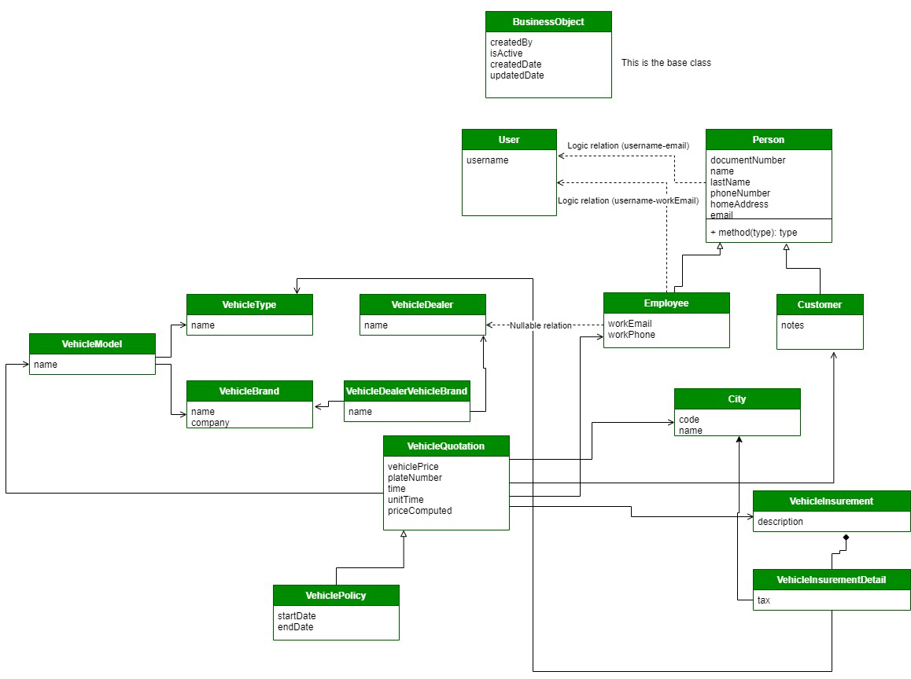
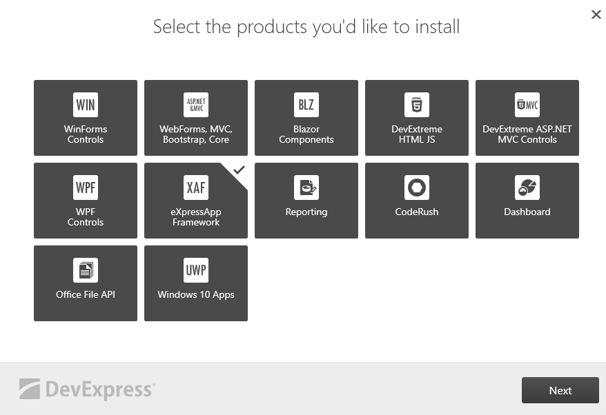
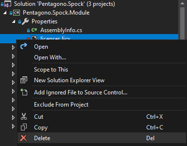

# SPOCK (Sistema de Pólizas y Cotizaciones para Brokers)

This project was development under [this specifications](./docs/Requirements.pdf).

### TODO
  - Compute price in Vehicle Quotation.
  - Transform Quotation into Policy.
  - Reports of quotations and policies.
  - Rol seeder (Administrador del sistema, Responsable de concesionario, Ejecutivo de ventas de consesionario y Cliente).

<!--
### Live website

[http://spock.somee.com](http://spock.somee.com)
-->

### Credentials

  - **User:** admin
  - **Pass:** {empty}

### Diagram



[Open diagram](https://drive.google.com/file/d/1rCaXEnFWr6deSvD_lh1VbxAknSN-yqIL/view?usp=sharing)

### Dependencies

  - .NET Framework 4.7.2
  - MSQLServer
  - [XAF DevExpress Trial 20.2.5](https://go.devexpress.com/DevexpressDownload_UniversalTrial.aspx)



### Configuration

Change the string connection in [web config file](https://github.com/kevinbarja/spock/blob/5d4c6c0c22959dd0a3c34d43733572d736c5e7bc/Pentagono.Spock/Pentagono.Spock.Web/Web.config#L53)

```
<add name="ConnectionString" connectionString="XpoProvider=MSSqlServer; data source=YOUR-HOST; initial catalog=spock; User Id=YOUR-USER-DB; Password=YOUR-PWD-DB; Persist Security Info=True;" />
```

Create a database called **spock**

### Delete license file
If you have a problemm with the licence file, please delete these files.

  
### Tutorials

  - [Creating an ASP.NET Blog Engine with DevExpress- Part 1](https://www.youtube.com/watch?v=AMIIPI9XWjc)
  - [¿Qué tan rápido es el desarrollo en XAF?](https://www.youtube.com/watch?v=RfevAkFxa5Q)
  - [XAF: Create an Application Based on an Existing XPO Database](https://www.youtube.com/watch?v=vw5ZnJ-9Iyw)